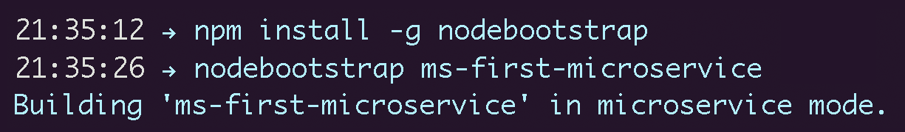

  <body id="homepage">
  

    

    

      

        <h1>NodeBootstrap</h1>
      

      
      

        <iframe src="https://ghbtns.com/github-btn.html?user=inadarei&repo=nodebootstrap&type=star&count=true&size=large" frameborder="0" scrolling="0" width="160px" height="30px"></iframe>
        
        <iframe src="https://ghbtns.com/github-btn.html?user=inadarei&repo=nodebootstrap&type=fork&count=true&size=large" frameborder="0" scrolling="0" width="160px" height="30px"></iframe>
      

      
      

        

          <h2>Powerful Node.js + Express project scaffolding that is unobtrusive</h2>
        

      

      

        Bootstrap and organize your Node.js project like a pro. Right out of the gate N.B. gets a [metric] ton of boilerplate taken care of: clustering, Docker-support, error-handling, code modularity, logging, views, environments – you name it. And all of that without having to deal with a heavy or an opinionated framework! MIT Licensed.
      

      
      

      

      

        
      

      

      

    
<!-- // .container-fluid -->
    
<!-- // .content-column -->
  
<!-- // .top-part -->
      
    

    

      

        <a href="documentation.html" class="btn btn-primary btn-lg" role="button"><i class="fa fa-book fa-fw"></i> Documentation</a>
        <a href="https://github.com/inadarei/nodebootstrap" class="btn btn-success btn-lg hidden-xs hidden-sm" role="button"><i class="fa fa-github fa-fw"></i> GitHub</a>
        <a href="https://twitter.com/nodebootstrap" class="btn btn-info btn-lg" role="button"><i class="fa fa-twitter fa-fw"></i> Twitter</a>
      

      
      

      Enjoyed by these awesome companies, among others:
      

      
      <!-- 

      

        

        

        

          
        

        

      

      Would like to see your logo here, as well? <a href="https://github.com/inadarei/nodebootstrap/issues/41">Let us know.</a>
      
 -->

      

      <ul class="logos clearfix">
        <li></li>
        <li></li>
        <li></li>          
        <li></li>
        <li></li>
      </ul>
      Would like to see your logo here, as well? <a href="https://github.com/inadarei/nodebootstrap/issues/41">Let us know.</a>
      

                      
  
<!--// .container-fluid -->
  
<!--// .content-column -->
    
  
   <!-- http://www.mattboldt.com/demos/typed-js/ -->
  
  

  </body>
